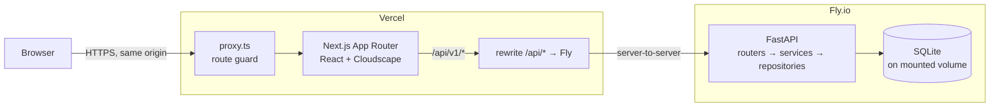
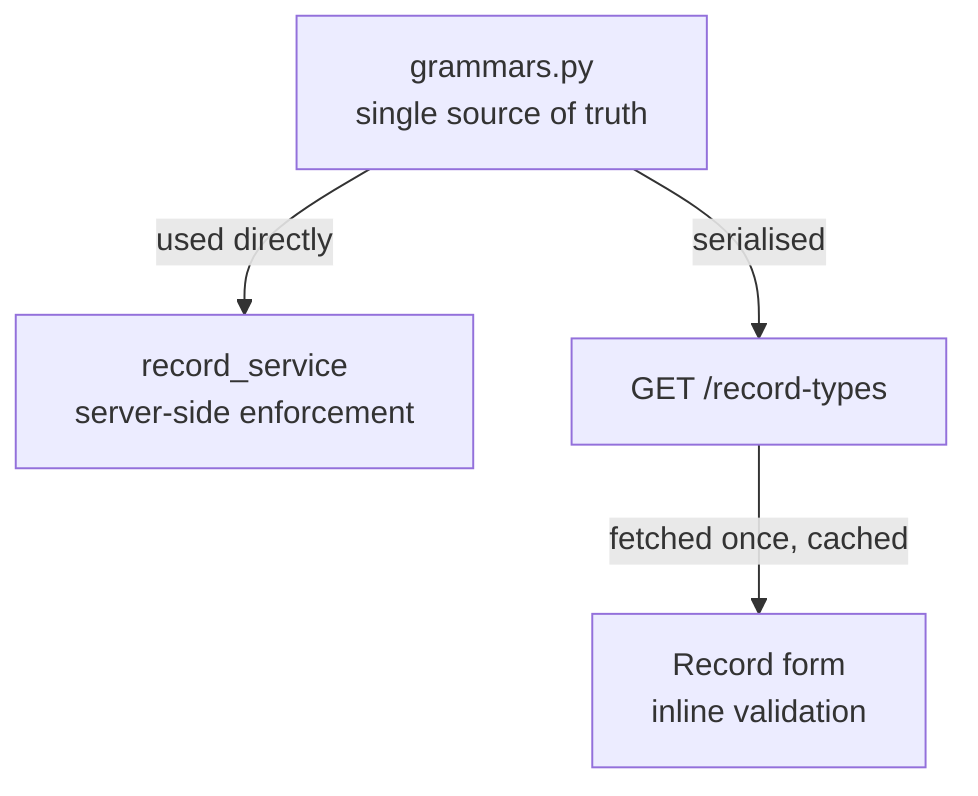
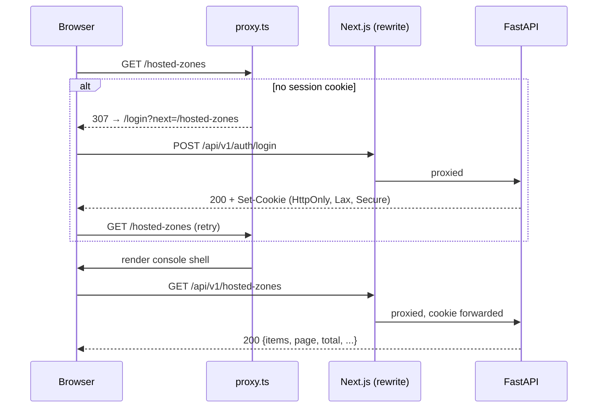

# Architecture

| | |
|---|---|
| **Phase** | 2 of 6 — Design ([roadmap](./00-sdlc-roadmap.md)) |
| **Companions** | [Data model](./05-data-model.md) · [API contract](./06-api-contract.md) |
| **Built against** | [Requirements SRS](./01-requirements.md) · [Design decisions](./02-design-decisions.md) |

---

## 1. System topology



**The browser only ever talks to one origin.** Next.js rewrites `/api/*` to the Fly backend, so the
session cookie is same-origin — see [DD-16](./02-design-decisions.md#dd-16--next-js-rewrite-proxy-instead-of-cross-origin-calls).
The Fly service stays publicly reachable so its OpenAPI UI at `/docs` is linkable from the README
(`AS-D7`).

| Concern | Resolution |
|---|---|
| Session cookie | `SameSite=Lax; Secure; HttpOnly` — first-party, so no third-party-cookie blocking |
| CORS | Not needed for the browser path. Backend keeps a narrow allow-list only for direct `/docs` use |
| Route guarding | `proxy.ts` reads the cookie server-side and redirects before any page renders |
| Persistence | SQLite file on a Fly volume, so data survives redeploys (`NFR-12`) |

---

## 2. Backend

### 2.1 Layers

Four layers, per `NFR-5` and [DD-17](./02-design-decisions.md#dd-17--four-layer-backend-routers--services--repositories--models).
Each layer may only call the one below it.

| Layer | Responsibility | Must **not** |
|---|---|---|
| `routers/` | HTTP: path and query binding, Pydantic request/response schemas, status codes | contain domain rules |
| `services/` | Domain rules and **transaction boundaries** — CNAME coexistence, required-record protection, non-empty-zone deletion, cascade, quota enforcement | build SQL or touch `Session` directly |
| `repositories/` | Query construction and persistence. Accepts a `Session`, returns models | commit, or make policy decisions |
| `models/` | SQLAlchemy ORM entities | contain behaviour beyond simple derived properties |

**Transactions are owned by services, never repositories.** A repository never calls `commit()`; a
service opens the unit of work, calls one or more repositories, and commits once. This is what makes
`FR-B18a`'s cascade delete and `FR-G3`'s atomic import correct rather than accidental.

Domain errors are raised as typed exceptions from `services/` and translated to HTTP by a single
exception handler — routers never build error bodies by hand, which is what keeps `NFR-3`'s uniform
error shape actually uniform.

### 2.2 Structure

```
backend/
  app/
    main.py                  FastAPI app, middleware, exception handlers
    config.py                pydantic-settings, env-driven

    core/
      security.py            JWT sign/verify, cookie helpers
      errors.py              DomainError hierarchy + handlers → NFR-3 body
      pagination.py          Page[T] envelope, limit/offset parsing

    db/
      session.py             engine, SessionLocal, PRAGMA hooks
      base.py                declarative Base

    models/                  user, hosted_zone, record_set, record_value, hosted_zone_tag
    schemas/                 Pydantic request/response, incl. the Page[T] envelope

    repositories/
      base.py                shared list/filter/paginate helper
      user_repo.py
      hosted_zone_repo.py
      record_set_repo.py

    services/
      auth_service.py
      hosted_zone_service.py
      record_service.py
      generators.py          zone IDs, nameservers, SOA, change IDs  (DR-12)
      catalogues.py          alias targets, regions, account ID       (DR-11)
      validation/
        grammars.py          the 9 type grammars — single source of truth (FR-D6)
        semantic.py          CNAME coexistence, apex rules, quotas
      bind/
        parser.py            BIND → records, with per-line diagnostics (FR-G3)
        serializer.py        records → BIND / JSON                    (FR-G2)

    routers/                 auth, hosted_zones, records, record_types

  alembic/versions/
  seed/
    fixtures/*.yaml          declarative demo data (DR-10)
    seed.py                  idempotent loader, --reset
  tests/
  examples/                  sample BIND files (DR-14)
```

### 2.3 Validation, and why it is split

`FR-D6` requires the nine record-type grammars to exist **once**. They live in
`services/validation/grammars.py` and reach the frontend two ways:



The split that matters:

| Rule kind | Where enforced | Example |
|---|---|---|
| **Syntactic** — expressible as a pattern | Both. Backend enforces; frontend renders the same rule from `/record-types` | `10 mail.example.com` is a valid MX |
| **Semantic** — needs a database lookup | Server only, surfaced via the `field` pointer on a `422`/`400` | No CNAME where an A already exists at that name |

No grammar is ever written in TypeScript.

---

## 3. Frontend

### 3.1 Structure

```
frontend/src/
  app/
    layout.tsx                     html shell, Cloudscape global CSS, providers
    proxy.ts                  cookie check → redirect to /login?next=
    login/page.tsx
    (console)/
      layout.tsx                   AppLayout: SideNavigation, breadcrumbs, Flashbar slot
      hosted-zones/
        page.tsx                   list  (FR-B1–B9)
        create/page.tsx            full-page create (FR-B10)
        [zoneId]/
          layout.tsx               tabs + breadcrumbs
          page.tsx                 Records tab (FR-C3–C8)
          details/page.tsx         Hosted zone details (FR-B23)
          edit/page.tsx            (FR-B15)
          records/
            create/page.tsx        (FR-C9)
            [recordId]/edit/page.tsx
      dashboard|health-checks|traffic-policies|resolver|profiles/page.tsx   ComingSoon

  features/
    auth/            useSession, LoginForm
    hosted-zones/    queries.ts (TanStack hooks), components/
    records/         queries.ts, components/, RecordValueField

  components/
    shell/           AppShell, SideNav, TopNav, Breadcrumbs
    table/           useTableState, ConsoleTable, DeleteModal
    ComingSoon.tsx

  lib/
    api/             GENERATED from OpenAPI — do not edit (NFR-1)
    notifications.ts Flashbar store
    format.ts        dates, IDs
```

### 3.2 State

Three kinds, deliberately kept apart:

| State | Owner | Notes |
|---|---|---|
| **Server state** | TanStack Query | The only source for zones and records. No `fetch` in components (`NFR-6`) |
| **List state** — search, filter, sort, page | **The URL** | One `useTableState` hook binds Cloudscape's `TextFilter`/`Pagination`/sorting to query params, so every view is shareable and the back button works (`FR-E11`) |
| **Ephemeral UI** — modal open, form draft | Local `useState` | Never lifted to a global store |

Notifications are a small module rather than component state, because a mutation on a detail page
must be able to raise a `Flashbar` after navigating back to the list (`FR-B14`, `FR-B20`).

### 3.3 Cloudscape under the App Router

Cloudscape is client-only React (risk **R2**). Containment strategy:

- Global CSS imported **once** in the root `layout.tsx`.
- `(console)/layout.tsx` is the single `"use client"` boundary holding `AppLayout`; pages below it
  are ordinary client components.
- The App Router still owns routing, layouts, and `proxy.ts` — so nav, breadcrumbs, and deep
  links stay real URLs rather than client-side view switching.
- **Prototyped in implementation slice 1**, before any screen depends on it.

---

## 4. Authentication flow



`proxy.ts` checks only for the cookie's **presence** — a cheap gate that avoids rendering the
shell for signed-out users. The backend independently verifies the JWT on every request; the
proxy is never the security boundary. A `401` from any call clears client state and redirects
once (`FR-A8`).

**Naming note (2026-07-27):** this document originally named this file `middleware.ts`, correct at
the time of writing. Next.js 16 deprecated and renamed the `middleware` file convention to `proxy`
(same purpose — code that runs before a route renders — new file name and exported function name).
The version actually installed in Slice 0 is 16.2.12, so every reference here uses `proxy.ts`;
implement it as `frontend/src/proxy.ts` exporting `proxy()`, not `middleware.ts`.

---

## 5. Cross-cutting concerns

| Concern | Approach |
|---|---|
| **Errors** | Typed `DomainError` subclasses in services → one FastAPI exception handler → `NFR-3` body. The frontend branches on `error.code` and attaches `error.field` to the matching `FormField` |
| **Notifications** | Every mutation hook has `onSuccess`/`onError` pushing a `Flashbar` item (`FR-E4`). No silent failures (`NFR-10`) |
| **Loading** | In-table skeletons and inline button spinners only (`FR-E9`); never a full-page loader |
| **Pagination** | One `Page[T]` envelope, one `useTableState` hook, applied identically to both tables (`FR-E6`) |
| **Config** | `pydantic-settings` on the backend, `NEXT_PUBLIC_*` on the frontend, `.env.example` committed, no secrets in the repo (`NFR-11`) |
| **Types** | `openapi-typescript` generates `lib/api` from FastAPI's schema in CI. Hand-written API types are prohibited (`NFR-1`) |

---

## 6. Environments

| Variable | Side | Purpose |
|---|---|---|
| `DATABASE_URL` | backend | `sqlite:////data/route53.db` on Fly — the mounted volume path |
| `JWT_SECRET` | backend | Token signing |
| `CORS_ORIGINS` | backend | Direct `/docs` access only; the browser path is same-origin |
| `DEMO_MODE` | both | Shows seeded credentials on the login page |
| `BACKEND_ORIGIN` | frontend | Rewrite target in `next.config.ts` |

**Local development** — `docker compose up` runs both halves against a SQLite volume (`NFR-13`),
with the same rewrite wiring as production so the auth path is identical in dev and prod. Each half
also runs standalone (`uvicorn` / `next dev`) for faster iteration.

**Clarified 2026-07-27** — seeding is a separate, explicit `python -m seed --reset` step (in the
README), never triggered by app boot or by `docker compose up` itself, per `DR-10`. "A seeded
volume" describes the state after following setup steps, not an automatic behavior.

---

## 7. Traceability

| Requirement | Where satisfied |
|---|---|
| `NFR-5` layered backend | §2.1, §2.2 |
| `NFR-6` feature-organised frontend, no ad-hoc fetch | §3.1, §3.2 |
| `NFR-1` generated client | §5, §3.1 (`lib/api`) |
| `NFR-2`/`NFR-3`/`NFR-4` uniform envelope, errors, statuses | §2.1, §5 |
| `NFR-12` persistence + deployment | §1, §6 |
| `FR-A2`, `FR-A6`, `FR-A8` auth and guarding | §4 |
| `FR-D6` validation metadata | §2.3 |
| `FR-E11` URL-synced list state | §3.2 |
| Risk **R1** cross-origin cookies | Resolved in §1 — DD-16 |
| Risk **R2** Cloudscape + App Router | Contained in §3.3 |
