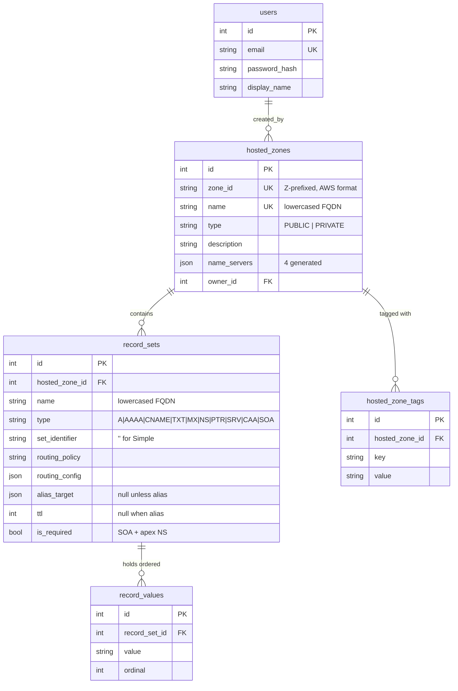

# Data Model

| | |
|---|---|
| **Phase** | 2 of 6 — Design ([roadmap](./00-sdlc-roadmap.md)) |
| **Companions** | [Architecture](./04-architecture.md) · [API contract](./06-api-contract.md) |
| **Satisfies** | `AS-T3`, `AS-H7`, `AS-R16`, `AS-D6` · `DR-1` – `DR-14` |

---

## 1. Entity relationships



**The shape that matters:** `record_sets → record_values` is one-to-many. That is what makes
`www.example.com` with three IPs **one row rendering three stacked values**, exactly as the Route53
console shows it — rather than three near-identical rows. See
[DD-8](./02-design-decisions.md#dd-8--records-are-record-sets-with-values-in-a-child-table).

---

## 2. Tables

### 2.1 `users`

| Column | Type | Constraints | Notes |
|---|---|---|---|
| `id` | INTEGER | PK | |
| `email` | TEXT | NOT NULL, **UNIQUE** | Login identity, stored lowercased |
| `password_hash` | TEXT | NOT NULL | bcrypt. Never a plaintext column, even for seeded demo users |
| `display_name` | TEXT | NOT NULL | Rendered in `Created by` and the top-nav user menu |
| `created_at` / `updated_at` | TIMESTAMP | NOT NULL | UTC (`DR-8`) |

Seeded only — there is no signup (`AS-A1`).

### 2.2 `hosted_zones`

| Column | Type | Constraints | Notes |
|---|---|---|---|
| `id` | INTEGER | PK | Internal surrogate key |
| `zone_id` | TEXT | NOT NULL, **UNIQUE** | Public `Z…` identifier. Every API path and UI reference uses this, never `id` |
| `name` | TEXT | NOT NULL, **UNIQUE** | Lowercased FQDN without trailing dot. Uniqueness backs `409 ConflictingDomainExists` (`FR-B12`) |
| `type` | TEXT | NOT NULL, CHECK ∈ (`PUBLIC`,`PRIVATE`) | `FR-B10` |
| `description` | TEXT | NULL, ≤ 256 chars | The only freely editable field (`FR-B15`) |
| `name_servers` | JSON | NOT NULL | The four generated nameservers (`DR-12`). Denormalised deliberately — see §5 |
| `owner_id` | INTEGER | FK → `users.id` | Drives `Created by`. Not a permission boundary (`§4.2 #3`) |
| `created_at` / `updated_at` | TIMESTAMP | NOT NULL | UTC |

**`name` and `type` are immutable after insert**, enforced in the service layer (`FR-B15`).

### 2.3 `record_sets`

| Column | Type | Constraints | Notes |
|---|---|---|---|
| `id` | INTEGER | PK | |
| `record_id` | TEXT | NOT NULL, UNIQUE | Opaque public identifier used in API paths |
| `hosted_zone_id` | INTEGER | NOT NULL, FK → `hosted_zones.id` ON DELETE CASCADE | |
| `name` | TEXT | NOT NULL | Lowercased FQDN. Apex records equal the zone name |
| `type` | TEXT | NOT NULL, CHECK ∈ the 9 types + `SOA` | `SOA` is generated, never user-creatable |
| `set_identifier` | TEXT | NOT NULL, DEFAULT `''` | Route53's differentiator for non-Simple policies. Empty string rather than NULL so the unique constraint works in SQLite — see §5 |
| `routing_policy` | TEXT | NOT NULL, DEFAULT `SIMPLE` | One of the eight (`FR-C11`) |
| `routing_config` | JSON | NULL | Weight, region, country, failover role. Stored and displayed, never evaluated (`AS-O4`) |
| `alias_target` | JSON | NULL | Non-null ⟹ alias record ⟹ `ttl` must be NULL ([DD-14](./02-design-decisions.md#dd-14--alias-target-as-a-nullable-json-column)) |
| `ttl` | INTEGER | NULL, CHECK 0 – 2147483647 | Required unless alias (`FR-D2`) |
| `is_required` | BOOLEAN | NOT NULL, DEFAULT false | Marks the auto-created SOA and apex NS sets protected by `FR-C16` |
| `created_at` / `updated_at` | TIMESTAMP | NOT NULL | UTC |

**Unique:** `(hosted_zone_id, name, type, set_identifier)` — the record-set identity from `FR-C1`.
A violation is the `409` that tells the user to edit the existing record instead.

**`name` and `type` are immutable after insert** — Route53 treats them as the record's identity
(`FR-C14`).

### 2.4 `record_values`

| Column | Type | Constraints | Notes |
|---|---|---|---|
| `id` | INTEGER | PK | |
| `record_set_id` | INTEGER | NOT NULL, FK → `record_sets.id` ON DELETE CASCADE | |
| `value` | TEXT | NOT NULL, ≤ 4000 chars | Length ceiling is Route53's TXT maximum `[VERIFIED]` |
| `ordinal` | INTEGER | NOT NULL | 0-based display order. Route53 preserves value order; so do we |
| `created_at` / `updated_at` | TIMESTAMP | NOT NULL | UTC. Added to match `DR-8` ("every table") — omitted from an earlier draft of this table |

**Unique:** `(record_set_id, ordinal)`.

A separate table rather than a JSON array so value search (`FR-C4`) is an **indexed column lookup**
rather than a scan over a blob, and per-value limits are enforced by the schema (`DR-3`).

### 2.5 `hosted_zone_tags`

| Column | Type | Constraints |
|---|---|---|
| `id` | INTEGER | PK |
| `hosted_zone_id` | INTEGER | NOT NULL, FK → `hosted_zones.id` ON DELETE CASCADE |
| `key` | TEXT | NOT NULL |
| `value` | TEXT | NOT NULL |
| `created_at` / `updated_at` | TIMESTAMP | NOT NULL | UTC. Added to match `DR-8` ("every table") — omitted from an earlier draft of this table |

**Unique:** `(hosted_zone_id, key)`. Dedicated rather than polymorphic — only zones are taggable in
this scope (`§4.2 #23`).

---

## 3. Indexes

Each exists to serve a named requirement; none are speculative.

| Index | Serves |
|---|---|
| `hosted_zones(name)` (unique) | `FR-B3` search, `FR-B12` duplicate detection |
| `hosted_zones(zone_id)` (unique) | Every zone lookup by public ID |
| `hosted_zones(type)` | `FR-B4` type filter |
| `record_sets(hosted_zone_id, name, type, set_identifier)` (unique) | `FR-C1` identity + `409` conflict |
| `record_sets(hosted_zone_id, type)` | `FR-C5` type filter |
| `record_sets(hosted_zone_id, is_required)` | `FR-B18` non-empty check — a `COUNT` rather than a full scan |
| `record_values(record_set_id, ordinal)` (unique) | Ordered value fetch |
| `record_values(value)` | `FR-C4` search-by-value — the index that justifies `DR-3` |

---

## 4. SQLite specifics

```sql
PRAGMA foreign_keys = ON;   -- REQUIRED: off by default, per connection
PRAGMA journal_mode = WAL;  -- concurrent readers alongside one writer
PRAGMA busy_timeout = 5000; -- wait rather than fail on lock contention
```

**`foreign_keys` is off by default in SQLite and is per-connection**, so it is applied via a
SQLAlchemy `connect` event listener. Without it every `ON DELETE CASCADE` in this schema is silently
inert — cascades would appear to work in review and leave orphans in production (`DR-6`).

WAL and the busy timeout address risk **R3**. `TIMESTAMP` values are stored UTC and rendered in the
viewer's zone (`FR-E10`).

---

## 5. Design notes

**Why `zone_id`/`record_id` alongside integer PKs.** Public identifiers are AWS-shaped strings
(`Z1D633PJN98FT9`). Integer PKs stay internal for join efficiency; the public string is what appears
in URLs and API paths, so internal keys never leak and are never guessable.

**Why `name_servers` is denormalised JSON on the zone.** The four nameservers are also the values of
the apex NS record set, so they are technically duplicated. Keeping them on the zone lets
`FR-B23`'s details panel render without joining through `record_sets → record_values`, and they are
generated once at creation and never edited. The apex NS record remains the source of truth for
DNS-shaped operations such as export.

**Why `set_identifier` defaults to `''` rather than NULL.** In SQLite — as in the SQL standard —
`NULL` values are distinct in a unique index, so `(zone, 'www', 'A', NULL)` could be inserted
repeatedly without violating the constraint. The empty string makes the constraint actually
enforce `FR-C1`.

**Why `SOA` is in the type CHECK but not in the nine.** The brief names nine user-creatable types
(`AS-R2` – `AS-R10`). SOA is generated by the system at zone creation (`FR-B13`) and can never be
created or deleted by a user, so it belongs in the column domain but not in the create form.

**Generated identifier formats.** `FR-B13`/`DR-12` give one worked nameserver example but don't
say how values vary between zones — added here since `DR-12` requires them "computed per zone" and
"stable for a given zone," and two zones with identical nameservers would look wrong side by side.
All four are `[UNVERIFIED format]`, consistent with the zone-ID entry in `FR-B13`, and all retry a
few times on a uniqueness collision (astronomically unlikely at this scale, but not silently absent):

| Identifier | Format | Matches example |
|---|---|---|
| Zone ID | `Z` + 13 random chars from `[A-Z0-9]` | `Z1D633PJN98FT9` |
| Record ID | `rs_` + 6 random lowercase hex chars | `rs_8f21c4` |
| Change ID | `C` + 13 random chars from `[A-Z0-9]` | `C2682N5HXP0BZ4` |
| Nameservers | pick random base `B` in `[0, 65535]`; the four are `ns-{B+i}.awsdns-{(B-1984+i) mod 65536}.{tld}` for `i` in `0..3`, `tld` in `[com, net, org, co.uk]` — reproducing the example's exact numeric offset (`2048-1984=64`) while randomizing the base per zone | `ns-2048.awsdns-64.com`, `ns-2049.awsdns-65.net`, `ns-2050.awsdns-66.org`, `ns-2051.awsdns-67.co.uk` |

**SOA hostmaster value.** `FR-B13`'s SOA value format names a `<hostmaster-email>` field but not
its literal value. Fixed as `awsdns-hostmaster.amazon.com`, matching real Route53's convention.
`[UNVERIFIED]`.

---

## 6. Migrations

Alembic, not `create_all` (`DR-9`) — the schema is versioned and reviewable, which is direct
evidence for `AS-V4`.

| Revision | Contents |
|---|---|
| `0001_initial` | All five tables, constraints, indexes |
| *(subsequent)* | One revision per schema change; never edited after merge |

Data seeding is deliberately **not** a migration ([DD-15](./02-design-decisions.md#dd-15--demo-seed-data-strategy)) —
demo content stays out of schema history.

---

## 7. Seed fixtures

Declarative YAML loaded by `seed.py`, idempotent, `--reset` to wipe and reload (`DR-10`).

Two fixture files. `users.yaml` loads first — 2–3 seeded users (`§4.2 #2`), since there is no
signup (`AS-A1`). `zones.yaml`'s `owner` field resolves against `users.yaml` by email:

```yaml
# seed/fixtures/users.yaml
- email: admin@example.com
  display_name: Admin User
  password: DemoPass123!    # plaintext here only; seed.py bcrypt-hashes before insert
- email: jane.doe@example.com
  display_name: Jane Doe
  password: DemoPass123!
- email: devops@example.com
  display_name: DevOps Team
  password: DemoPass123!
```

```yaml
# seed/fixtures/zones.yaml
- name: example.com
  type: PUBLIC
  description: Primary production zone
  owner: admin@example.com
  tags: { Environment: production, Team: platform }
  records:
    - { name: example.com,      type: A,     ttl: 300,   values: [192.0.2.1] }
    - { name: www.example.com,  type: A,     ttl: 300,   values: [192.0.2.1, 192.0.2.2, 192.0.2.3] }
    - { name: example.com,      type: MX,    ttl: 3600,  values: ["1 aspmx.l.google.com", "5 alt1.aspmx.l.google.com"] }
    - { name: example.com,      type: TXT,   ttl: 300,   values: ['"v=spf1 include:_spf.google.com ~all"'] }
    - { name: _dmarc.example.com, type: TXT, ttl: 300,   values: ['"v=DMARC1; p=quarantine; rua=mailto:dmarc@example.com"'] }
    - { name: blog.example.com, type: CNAME, ttl: 300,   values: [ghs.googlehosted.com] }
    - { name: staging.example.com, type: NS,  ttl: 172800, values: [ns-1.awsdns-01.com, ns-2.awsdns-02.net] }
    - { name: example.com,      type: CAA,   ttl: 300,   values: ['0 issue "letsencrypt.org"'] }
```

SOA and apex NS are **not** in fixtures — they are generated by the same code path as a real create,
so the seeded state is reachable through the UI (`FR-B13`).

Volume per `DR-10`: ~15 zones across two pages with a Public/Private mix, one flagship zone with
≥25 record sets spanning all nine types, ~90 records total. The `staging.example.com` NS record
above exists specifically so `AC-9`'s deletable-subdomain-NS case is reachable from seeded data.

---

## 8. Worked example — the record-set model

Creating `www.example.com` A with three IPs:

```
record_sets
  id  zone  name              type  set_id  policy  ttl  is_required
  42  1     www.example.com   A     ''      SIMPLE  300  false

record_values
  id   record_set_id  value       ordinal
  101  42             192.0.2.1   0
  102  42             192.0.2.2   1
  103  42             192.0.2.3   2
```

Renders as **one row**, three stacked values (`FR-C7`). A second `A` at `www.example.com` violates
`(hosted_zone_id, name, type, set_identifier)` → `409`, and the UI directs the user to edit set 42
and add a value — matching Route53 (`FR-C1`).

Deleting the zone cascades: `hosted_zones` → `record_sets` → `record_values`, and `hosted_zones` →
`hosted_zone_tags`. Which only happens because §4's `PRAGMA foreign_keys = ON` is set.
